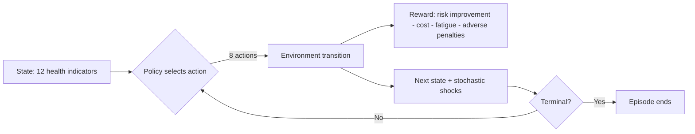

# Maternal & Child Health Mission RL (Summative)

This project implements a mission-based reinforcement learning system for **maternal and child health operations planning**.

## Mission Problem
A district health operations team must choose daily interventions under budget and workforce constraints to reduce:
- maternal risk,
- neonatal risk,
- immunization gaps,
- nutrition deficits,
- referral backlog,
- supply stress.

The environment includes stochastic shocks (outbreaks/weather), so policies must balance short-term emergency response and long-term prevention.

## Project Structure

- [environment/custom_env.py](environment/custom_env.py): Gymnasium environment (`MaternalChildHealthMissionEnv`)
- [environment/rendering.py](environment/rendering.py): Pygame simulation GUI
- [training/dqn_training.py](training/dqn_training.py): DQN training + 10-run sweep
- [training/pg_training.py](training/pg_training.py): PPO + A2C training + 10-run sweeps
- [training/reinforce_training.py](training/reinforce_training.py): REINFORCE training + 10-run sweep
- [training/run_all_experiments.py](training/run_all_experiments.py): orchestrates all 40 runs
- [training/plot_results.py](training/plot_results.py): generates required analysis plots
- [random_play.py](random_play.py): random agent visualization demo + static trace artifact
- [main.py](main.py): run best trained model in GUI with verbose terminal output
- [requirements.txt](requirements.txt): required dependencies

## Playback Experience (Upgraded)

The mission playback now includes:
- **Live mission context panel** (last action and per-step reward)
- **District-level risk map** tied to maternal/child health stress indicators
- **Trend sparkline** showing recent risk burden and reward trajectory
- **Controllable simulation speed** so demonstrations are clear for video/reporting

## Environment Design

### Action Space (`Discrete(8)`)
1. `deploy_mobile_antenatal_clinic`
2. `emergency_referral_transport`
3. `nutrition_supplement_distribution`
4. `routine_immunization_campaign`
5. `community_health_worker_training`
6. `medicine_and_blood_restock`
7. `remote_telemedicine_consultation`
8. `hold_and_monitor`

### Observation Space (`Box(12,)`)
Continuous state in [0,1]: maternal risk, neonatal risk, immunization gap, nutrition deficit, referral backlog, supply stress, community trust, weather severity, staff fatigue, normalized budget remaining, day progress, shock flag.

### Reward Design
Reward combines:
- risk burden reduction bonus,
- community trust bonus,
- fatigue/cost penalties,
- shock and adverse-event penalties,
- mission-success shaping bonuses.

### What "Supply" means (simple)
`medical_supply_stress` is a pressure score in $[0,1]$ for stockouts (medicines, blood products, maternal emergency kits, vaccines support materials).
- Near `0.0`: supply chain is stable.
- Near `1.0`: frequent shortages and delayed treatment/referral.

In the environment:
- Action `medicine_and_blood_restock` directly reduces supply stress.
- Severe weather and backlog can increase supply stress.
- High supply stress indirectly raises maternal/neonatal risk.

### Focused Maternal-Neonatal Mode (fewer features)
If you want to train with fewer features only, enable `MissionConfig(focused_mnh_mode=True)`.

Then observation space becomes 6 core features only:
1. maternal risk
2. neonatal risk
3. referral backlog
4. supply stress
5. community trust
6. budget remaining

### Start State
Moderate baseline risk with full budget and low-moderate fatigue.

### Terminal Conditions
Episode ends on:
- catastrophic outcomes,
- repeated preventable adverse events,
- mission success threshold,
- budget collapse,
- maximum mission duration.

## Environment Diagram



## Setup

1) Create and activate virtual environment
2) Install dependencies:

```bash
pip install -r requirements.txt
```

## Required Deliverables: How to Run

### A) Static random-action demonstration
```bash
python -m random_play --steps 180
```
Produces:
- [artifacts/random_agent_demo.gif](artifacts/random_agent_demo.gif) (visual static file artifact)
- [artifacts/random_actions_trace.json](artifacts/random_actions_trace.json) (step-by-step action/state trace)

### B) Train all 4 algorithms (10 runs each)
```bash
python -m training.run_all_experiments
```
This runs:
- DQN sweep (10)
- PPO sweep (10)
- A2C sweep (10)
- REINFORCE sweep (10)

Quick training option (fast debug):
```bash
python -m training.run_all_experiments --quick
```

Focused maternal/neonatal quick training (6 features):
```bash
python -m training.run_all_experiments --quick --focused
```

Experiment tables saved as:
- [results/dqn_experiments.csv](results/dqn_experiments.csv)
- [results/ppo_experiments.csv](results/ppo_experiments.csv)
- [results/a2c_experiments.csv](results/a2c_experiments.csv)
- [results/reinforce_experiments.csv](results/reinforce_experiments.csv)

### C) Generate analysis graphs
```bash
python -m training.plot_results
```
Outputs:
- cumulative reward curves
- DQN objective/stability curves
- PG entropy sensitivity curves
- convergence & generalization summary
in [results/plots](results/plots).

### D) Run best-performing model with GUI + verbose terminal
Examples:
```bash
/Users/carineash/Summative_assignment_reinforcement_learning/.venv/bin/python main.py --algo ppo --model models/ppo/ppo_run_03.zip --episodes 1
/Users/carineash/Summative_assignment_reinforcement_learning/.venv/bin/python main.py --algo dqn --model models/dqn/dqn_run_07.zip --episodes 1
```

Recommended slower demo mode (more presenter-friendly):
```bash
/Users/carineash/Summative_assignment_reinforcement_learning/.venv/bin/python main.py --algo dqn --model models/dqn/dqn_run_07.zip --episodes 1 --fps 3 --step-delay 0.15
```

Important: do not type square brackets around file names (for example, `main.py`, not `[main.py]`).

If playback looks too fast:
- lower `--fps` (for example `2` or `3`)
- increase `--step-delay` (for example `0.1` to `0.3`)

### Fast single-algorithm training commands
```bash
# DQN quick focused
python -m training.dqn_training --sweep --quick --focused

# PPO quick focused
python -m training.pg_training --algo ppo --sweep --quick --focused

# A2C quick focused
python -m training.pg_training --algo a2c --sweep --quick --focused

# REINFORCE quick focused
python -m training.reinforce_training --sweep --quick --focused
```

### One-command finalization (after training)
```bash
./finalize_submission.sh
```
This waits for training to complete, then automatically:
- verifies all 4 experiment CSV files,
- regenerates plots,
- selects the best model,
- builds [results/summative_report.pdf](results/summative_report.pdf).

### Video recording helper
# Maternal & Child Health Mission RL

This repository follows the required assignment structure.

## Repository Structure

project_root/
├── environment/
│   ├── custom_env.py
│   └── rendering.py
├── training/
│   ├── dqn_training.py
│   └── pg_training.py
├── models/
│   ├── dqn/
│   └── pg/
├── main.py
├── requirements.txt
└── README.md

## File Roles

- `environment/custom_env.py`: custom Gymnasium environment with 6 core observation features (maternal risk, neonatal risk, referral backlog, supply stress, community trust, budget remaining).
- `environment/rendering.py`: visualization GUI components.
- `training/dqn_training.py`: DQN training with Stable-Baselines3.
- `training/pg_training.py`: policy-gradient training (PPO/A2C) with Stable-Baselines3.
- `models/dqn/`: saved DQN model files.
- `models/pg/`: saved policy-gradient model files.
- `main.py`: run best model in the GUI.
- `requirements.txt`: mandatory dependencies.

## Quick Usage

Install dependencies:

pip install -r requirements.txt

Train DQN sweep:

python -m training.dqn_training --sweep

Train PPO sweep:

python -m training.pg_training --algo ppo --sweep

Train A2C sweep:

python -m training.pg_training --algo a2c --sweep

Run model:

python main.py --algo dqn --model models/dqn/dqn_run_01.zip --episodes 1

python main.py --algo ppo --model models/pg/ppo_run_01.zip --episodes 1
