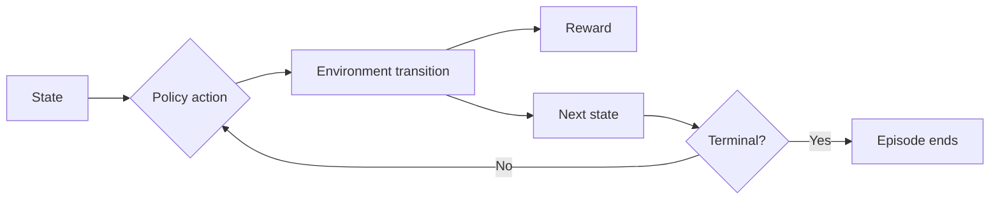

# Maternal & Child Health Mission RL 

Custom reinforcement learning project for maternal-child health mission planning.

## Environment

- **Action space:** `Discrete(8)` mission interventions
- **Observation space:** `Box(3,)` = maternal risk, neonatal risk, budget signal
- **Reward:** risk reduction + trust bonus - cost/fatigue/adverse-event penalties
- **Start state:** moderate risk, full budget, low/moderate fatigue
- **Terminal conditions:** mission success, catastrophic outcomes, budget collapse, or max duration
- **Visualization:** Pygame GUI in [environment/rendering.py](environment/rendering.py)

### Agent-Environment Diagram



## Algorithms Implemented

- DQN (value-based)
- PPO (policy)
- REINFORCE (policy gradient)

All algorithms use the same custom environment for objective comparison.

## Setup

```bash
pip install -r requirements.txt
```

## Training (10 experiments each)

```bash
python -m training.dqn_training --sweep --max-runs 10 --timesteps 20000 --eval-episodes 2
python -m training.pg_training --algo ppo --sweep --max-runs 10 --timesteps 20000 --eval-episodes 2
python -m training.pg_training --algo reinforce --sweep --max-runs 10 --timesteps 20000 --eval-episodes 2
```

## Static Random-Action Demo 

```bash
python main.py --random-demo --steps 180 --fps 8
```

Outputs:
- [results/random_demo/random_agent_demo.gif](results/random_demo/random_agent_demo.gif)
- [results/random_demo/random_actions_trace.json](results/random_demo/random_actions_trace.json)

## Analysis Plots

```bash
python -m training.pg_training --plot-results
```

Outputs in [results/plots](results/plots):
- cumulative reward curves
- DQN objective curves
- PG entropy curves
- convergence/generalization summary

## Best Models (Current)

- DQN: [models/dqn/dqn_run_05.zip](models/dqn/dqn_run_05.zip)
- PPO: [models/pg/ppo_run_02.zip](models/pg/ppo_run_02.zip)
- REINFORCE: [models/pg/reinforce_run_07.pt](models/pg/reinforce_run_07.pt)

Run with GUI + verbose terminal:

```bash
python main.py --algo ppo --model models/pg/ppo_run_02.zip --episodes 1 --fps 2 --step-delay 0.2
```

## Repository Structure

```text
project_root/
├── environment/
│   ├── custom_env.py
│   └── rendering.py
├── training/
│   ├── dqn_training.py
│   └── pg_training.py
├── models/
│   ├── dqn/
│   └── pg/
├── main.py
├── requirements.txt
└── README.md
```
